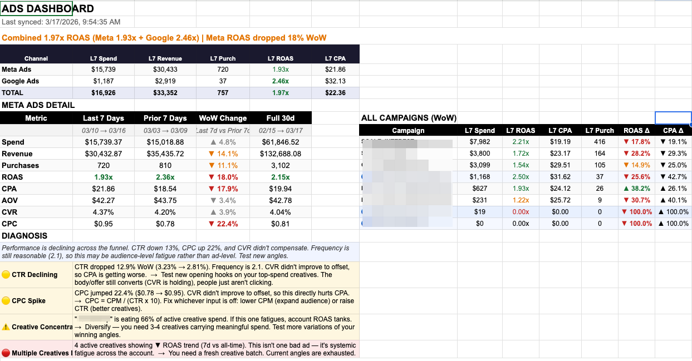
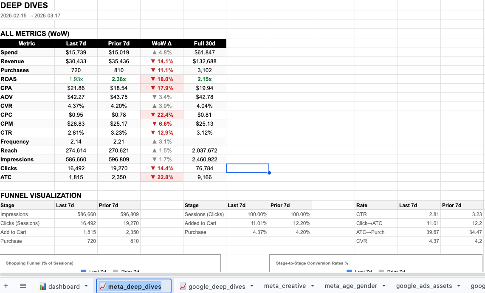
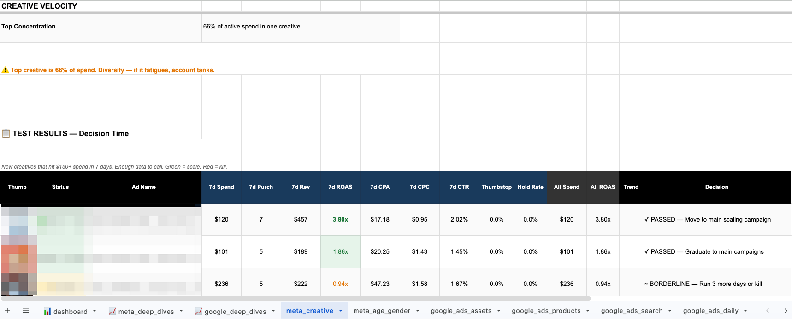
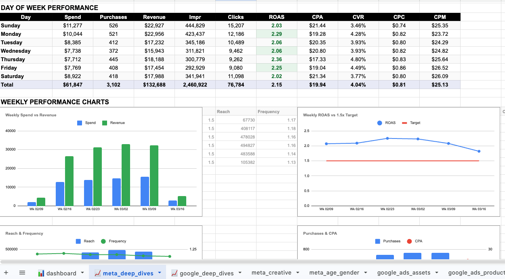
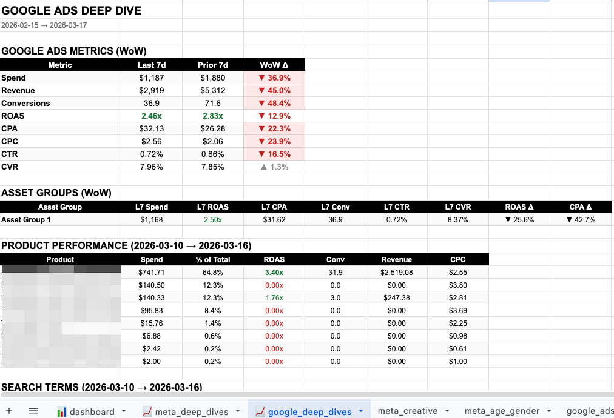
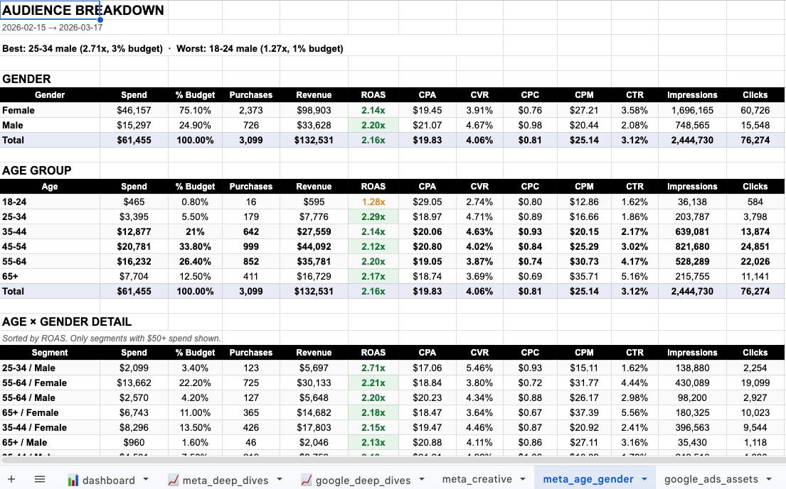

# Meta & Google Ads Dashboard Sync

This repository contains two scripts designed to synchronize advertising data from **Meta Ads** and **Google Ads** directly into **Google Sheets**. Together, they form an automated performance dashboard to track KPIs, find creative fatigue, and highlight actionable insights.

*Automated Dashboard with AI Insights*

*WoW Campaign Performance Tracking*

---

## 1. Meta Ads Sync + Decision Engine (`meta_ads_sync_v2.gs`)
This script pulls data from Meta's API into Google Sheets. It includes a built-in decision engine that generates action items, creative scoring, and fatigue detection.

*Creative Scoring and Fatigue Detection Tab*

### Features
- **Dashboard Construction**: Aggregates top-level numbers and flags issues (e.g., ROAS dropped, CPC spikes).
- **Creative & Ad Set Deep Dives**: Tracks performance per ad set and tracks creative engagement metrics (Thumbstop, Hold Rate).
- **AI Integration**: Optionally plug in a Claude or Gemini API key for advanced AI insights on your ad performance.

#### v2 — Intelligent Diagnostics (New)
- **Campaign Health Score** — A 0–100 composite score per campaign combining ROAS efficiency, frequency health, WoW trend, baseline deviation, and creative vitality. Color-coded in the campaign table for instant triage.
- **Frequency → ROAS Correlation** — Learns your account-specific frequency threshold where ROAS starts declining (instead of using a fixed number). Plotted as a dashed red threshold line directly on the Reach & Frequency chart.
- **Rolling Baseline Anomaly Detection** — Augments WoW comparison with a 4-week rolling baseline average. Catches slow drifts in CPM, ROAS, CPA, and CTR that week-over-week alone misses.
- **Budget Pacing Tracker** — Projects end-of-month spend based on your daily run rate. Color-coded variance bar (set `MONTHLY_BUDGET` in CONFIG to enable).
- **Creative Lifespan Model** — Computes your account's average creative lifespan from historical burnout data and warns when active winners are approaching the typical expiry window.

All five features run with **zero additional API calls** — pure in-memory computation added to the existing sync pipeline.

*Detailed Meta Metric Analysis*

*Visualized Meta Shopping Funnel*

### Setup Instructions
1. Create a **New Google Sheet**.
2. Go to **Extensions > Apps Script** from the top menu.
3. Replace the default `.gs` file content by copy-pasting the full code from `meta_ads_sync_v2.gs`.
4. Update the `CONFIG` object at the top of the file:
   - `ACCESS_TOKEN`: The access token for your Meta Developer app.
   - `AD_ACCOUNT_ID`: Your Meta Ad Account ID (format: `act_XXXXXXXXX`).
   - *Optional:* Tune `THRESHOLDS` (like `TARGET_ROAS`) for your business.
5. Save the file.
6. In the Apps Script editor, select the function `setupTriggers` from the dropdown and hit **Run**.
7. Authorize access when prompted. This will automatically schedule the script to refresh daily.

---

## 2. Google Ads Sync - PMax Enhanced (`google_ads_sync.js`) (Optional)
**Note:** A Google Ads account is entirely optional. If you only run Meta Ads, you can skip this section entirely. The Meta Ads sync script will still function perfectly without Google Ads data!

This script executes inside Google Ads and pushes 4 specialized data sets to the *same* Google Sheet:
- `google_ads_daily` — Campaign-level daily performance
- `google_ads_assets` — Asset group performance (PMax breakdowns)
- `google_ads_products` — Shopping product performance (what is actually selling)
- `google_ads_search` — Search term insights (queries triggering your PMax ads)

*Cross-channel Google Ads and PMax Insights*

### Setup Instructions
1. Open your **Google Ads Account**.
2. Go to **Tools & Settings > Bulk Actions > Scripts**.
3. Click the **+** button to create a **New Script**.
4. Paste the full code from `google_ads_sync.js`.
5. Update `CONFIG.SPREADSHEET_URL` with the full URL of the Google Sheet you created in the Meta setup step.
6. Click **Authorize** to let the script access your Google Ads account.
7. Click **Run** manually the first time to generate the sheets and data.
8. Go back to the Scripts overview page and schedule the script to run **Daily**.

---

## The Output
Once both scripts are set up and scheduled, you will have a single Google Sheet serving as an end-to-end mission control. It updates continuously, highlighting exactly what to scale, what to kill, and where your creative and funnel opportunities lie.

---

## Known Limitations

### 🔍 PMax Search Terms — Not Available via Scripts
The `google_ads_search` tab only shows search terms from **active Search and Shopping campaigns**.

**PMax (Performance Max) search term data is not accessible through Google Ads Scripts.** Google's `pmax_search_term_insight` resource is only available via the Google Ads REST API — it was never added to the Scripts runtime.

**Workaround:** In the Google Ads UI, go to **Campaigns → [Your PMax campaign] → Insights → Search terms** to view them manually. For PMax, the `google_ads_products` tab is generally more actionable — PMax optimizes for products, not keywords.
